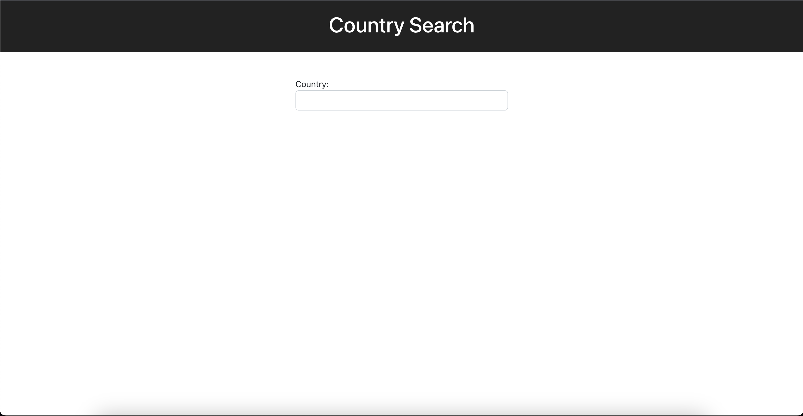
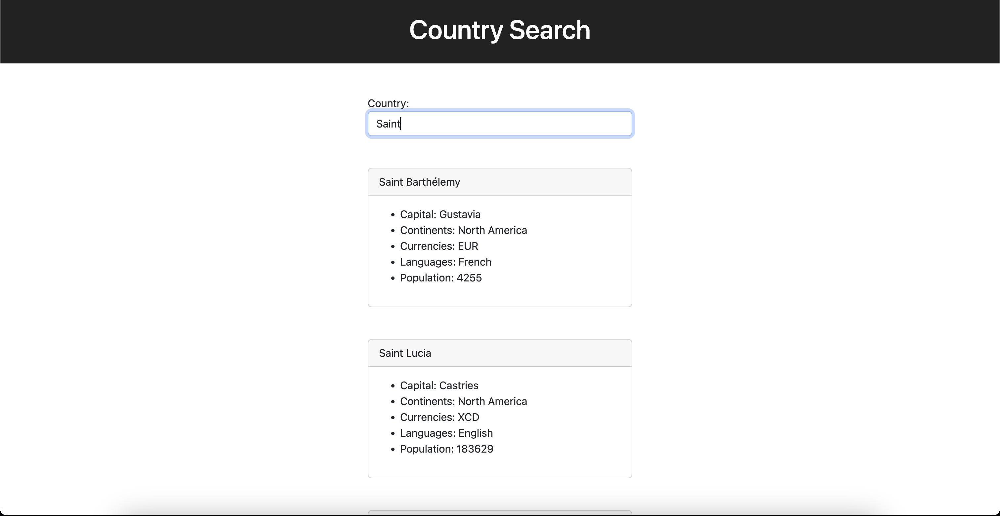
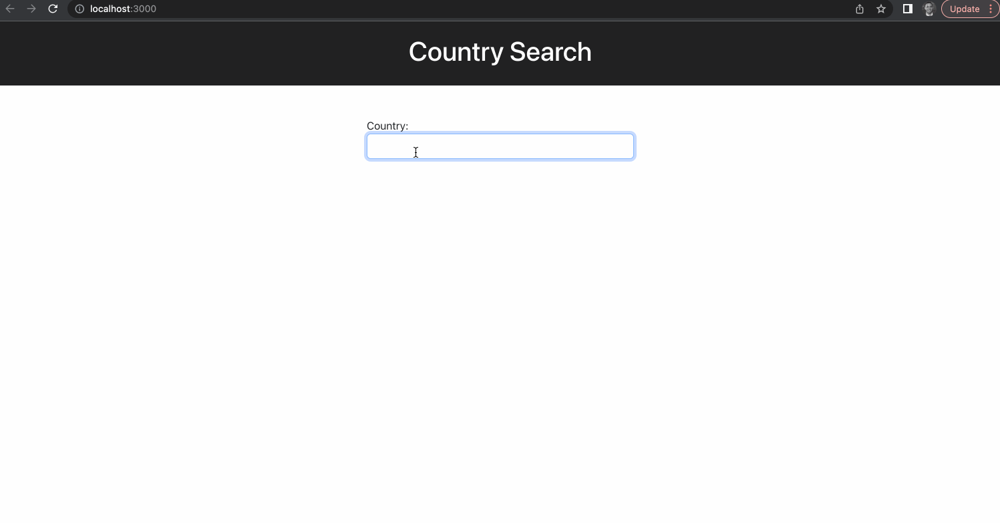

# React Country Search

In this assignment, I created small application that allows users to search for countries and view country data. Please check out the attached images and gifs below to see the output of a working example.

I used the [REST Countries API](https://restcountries.com/) to retrieve information for countries.

To search for a country, I sent a request to the following URL: 
```
https://restcountries.com/v3.1/name/countryNameGoesHere
```

## Requirements

- When a user types a valid country name, the application will retrieve associated information from an API.
- When the user types an invalid country name, the application should display `No results found.`
- A complete solution will reduce unnecessary API calls.

## Mockups

Add an input field where the user can enter a country name, like in the following image:



Use the user input to search against the REST Countries API. The API will respond with an object for each country if the country name is valid. Use that response to display each country in a separate div like in the following image:



Below you will find a small demo of a working solution.

